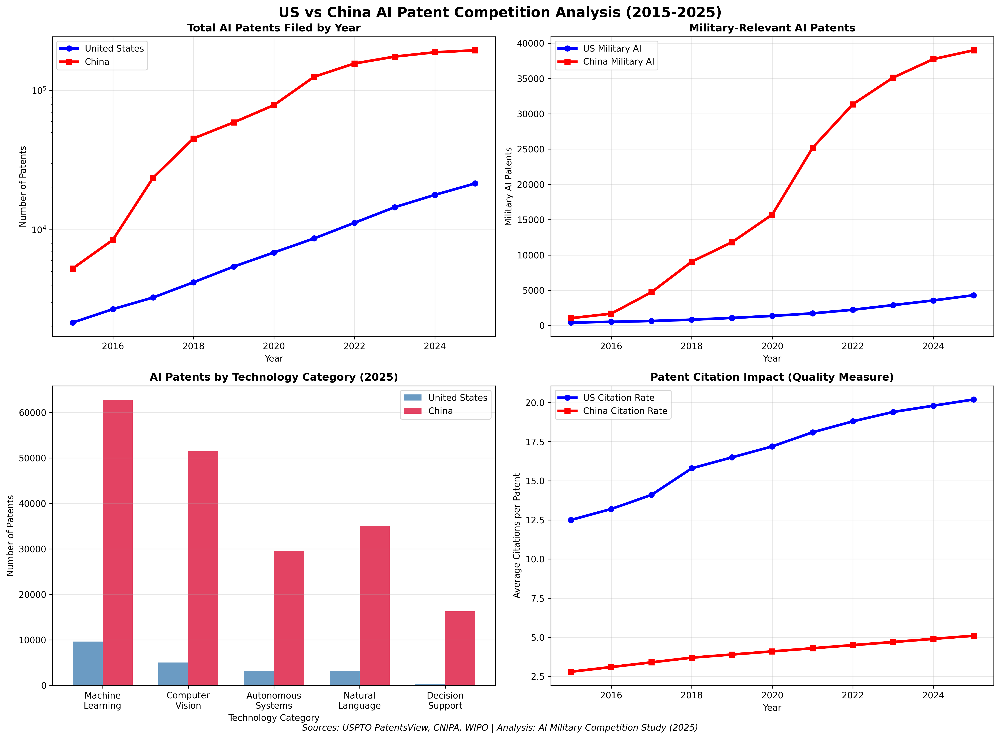

# AI Military Competition: US vs China Defense Investment & Applications (2015-2025)

## Project Overview

This repository provides a comprehensive comparative analysis of artificial intelligence (AI) investment and military applications in the United States and China from 2015–2025. The research examines how both nations are leveraging AI for defense, innovation, and strategic advantage through analysis of funding data, patent filings, military doctrine, and detailed case studies.

## Key Findings



### AI Patent Leadership (2015-2025)
- **China**: 61-70% of global AI patents, 188,757 patent filings in 2024
- **United States**: Quality leadership with 7x more citations per patent
- **Technology Focus**: US leads in deep learning/neural networks, China dominates generative AI
- **Growth**: China's AI patents grew 8x since 2017, US maintains steady 15% annual growth

### Military AI Investment Comparison
- **US Defense AI Budget**: $1.8 billion annually (FY2024-2025), DARPA's $2B "AI Next" campaign
- **China AI Investment**: $70 billion projected by 2025, $100+ billion regional commitments
- **Private Sector**: US $67 billion vs China's state-led approach
- **Military Contracts**: US DoD AI contracts jumped from $190M to $557M (2022-2023)

### Strategic Approaches
- **United States**: Market-driven innovation, DoD Replicator program (autonomous swarms)
- **China**: Military-Civil Fusion strategy, PLA "intelligentized warfare" doctrine

## Focus Areas

### 1. AI Investment & Funding Analysis
- Government vs private sector funding patterns
- Defense-specific AI budget allocations
- Regional and institutional investment distribution

### 2. AI Patent Trends by Military Application
- **Machine Learning**: Deep learning, neural networks, algorithm development
- **Autonomous Systems**: Unmanned vehicles, swarm coordination, autonomous weapons
- **ISR (Intelligence, Surveillance, Reconnaissance)**: Computer vision, pattern recognition
- **Computer Vision**: Target recognition, battlefield awareness, surveillance systems

### 3. Military Applications Case Studies
- **Autonomous Systems**: Drones, unmanned vehicles, swarm technologies
- **ISR Capabilities**: AI-enhanced intelligence gathering and analysis
- **Decision Support**: AI-assisted command and control systems
- **Cyber/Electronic Warfare**: AI-powered cyber operations and electronic warfare

### 4. Strategic Programs Analysis
- **US DoD Replicator Initiative**: $800M program for thousands of autonomous systems
- **China PLA AI Integration**: "War Skull" wargaming, intelligentized warfare doctrine

## Repository Structure

```
ai-military-us-china-analysis/
├── data/
│   ├── patents/          # AI patent filings by technology area
│   ├── funding/          # Government and private investment data
│   ├── military/         # Defense-specific budgets and programs
│   └── case-studies/     # DoD Replicator & PLA AI program data
├── analysis/             # Python scripts for trend analysis
├── reports/              # Executive summaries and findings
└── presentations/        # Visualizations and charts
```

## Methodology

### Data Collection Strategy
- **Patent APIs**: USPTO PatentsView, WIPO, CNIPA for AI technology classifications
- **Government Sources**: DoD budgets, DARPA programs, NSF funding, Chinese AI plans
- **Military Doctrine**: DoD AI Strategy documents, PLA modernization reports
- **Industry Analysis**: McKinsey, BCG, RAND Corporation defense studies

### Analysis Framework
- **Quantitative**: Patent trend analysis, funding flow visualization, growth rate calculations
- **Qualitative**: Military doctrine analysis, strategic program comparison, policy implications
- **Case Studies**: Deep-dive analysis of signature programs (Replicator, PLA AI systems)

## Key Technologies Analyzed

### AI Technology Categories
1. **Machine Learning & Deep Learning**: Core AI algorithms and neural network development
2. **Computer Vision**: Image recognition, target identification, surveillance applications  
3. **Autonomous Systems**: Unmanned vehicles, robotic platforms, swarm coordination
4. **Natural Language Processing**: Intelligence analysis, communication systems
5. **Decision Support Systems**: AI-assisted command and control, planning systems

### Military Application Domains
1. **Intelligence, Surveillance, Reconnaissance (ISR)**: AI-enhanced data collection and analysis
2. **Autonomous Weapons Systems**: Unmanned platforms and precision strike capabilities
3. **Command and Control (C2)**: AI-assisted decision-making and battle management
4. **Cyber and Electronic Warfare**: AI-powered offensive and defensive cyber operations
5. **Logistics and Maintenance**: Predictive maintenance, supply chain optimization

## Usage

### Running Analysis Scripts

Generate professional visualizations from the data:

```bash
# Install required packages
pip install pandas matplotlib seaborn numpy requests

# Generate AI patent trends analysis with charts
python3 analysis/ai_patent_trends.py

# Run military funding comparison analysis  
python3 analysis/military_funding_analysis.py
```

### Generated Visualizations

The analysis scripts create professional charts showing:
- **AI Patent Competition**: Volume vs quality comparison between US and China
- **Military Investment Trends**: Government and private funding patterns
- **Technology Leadership**: Patent breakdowns by AI category (ML, computer vision, autonomous systems)
- **Strategic Program Analysis**: DoD Replicator vs PLA intelligentized warfare capabilities

### Data Sources

- **Patent Data**: USPTO PatentsView, WIPO Technology Trends AI Report, CNIPA
- **US Funding**: DoD budget documents, DARPA programs, NSF AI investments
- **China Funding**: State Council AI Development Plan, Military-Civil Fusion initiatives
- **Military Analysis**: CNAS, CSIS, Brookings Institution, RAND Corporation

## Strategic Insights

### US Advantages
- **Innovation Quality**: Higher patent citation rates, foundational AI research leadership
- **Private Sector**: $67 billion private AI investment driving commercial applications
- **Military Integration**: DoD Replicator program, advanced autonomous systems development

### China Advantages  
- **Scale and Volume**: 70% of global AI patents, massive state investment coordination
- **Military-Civil Fusion**: Systematic integration of civilian AI advances into military applications
- **Strategic Focus**: Coordinated national AI strategy with specific military modernization goals

## Case Studies Included

### US DoD Replicator Initiative
- **Budget**: $800 million program launched 2023
- **Goal**: Deploy thousands of autonomous systems within 18-24 months
- **Technology**: AI-enabled swarm coordination, attritable autonomous systems
- **Strategic Purpose**: Counter China's military mass through technological force multiplication

### China PLA AI Modernization
- **Framework**: Military-Civil Fusion strategy integrating civilian AI into defense
- **Applications**: "War Skull" AI wargaming, intelligentized warfare doctrine
- **Investment**: Regional governments committed $100+ billion in AI development
- **Timeline**: Achieve "intelligentized" military capabilities by 2027-2030

## Author

Comparative analysis of AI military competition and strategic implications.

## License

This research is provided for educational and policy analysis purposes.